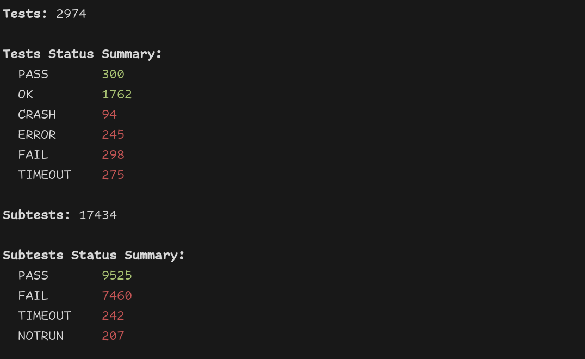
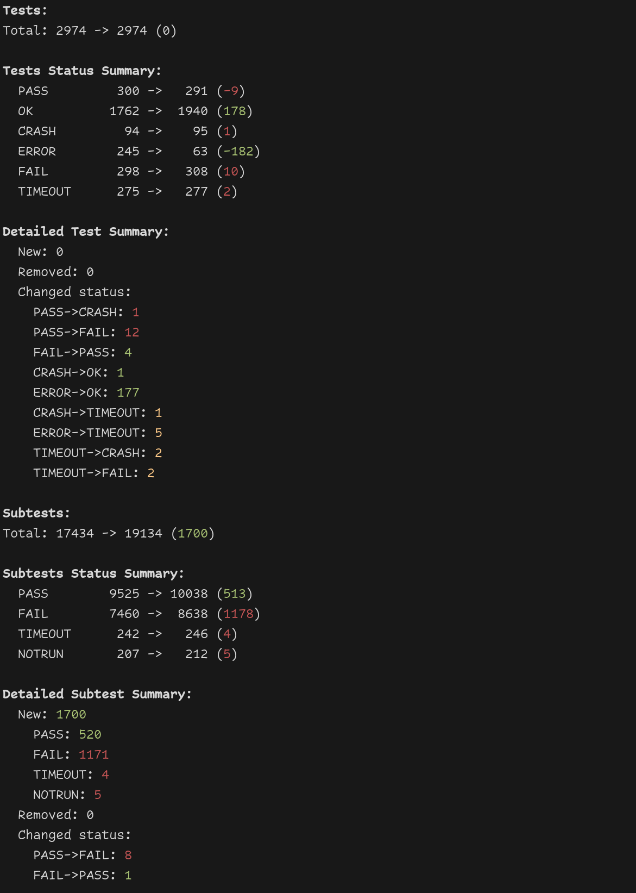
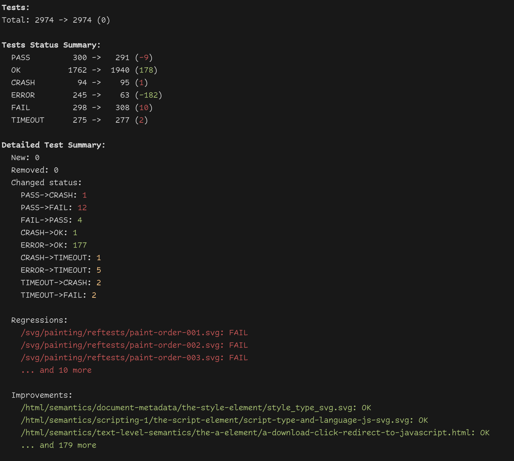

# WPT Results Analyzer

WPT Results Analyzer is a Python tool for analyzing and comparing Web Platform Tests (WPT) result files. It provides detailed insights into test and subtest outcomes, making it easier to track changes and improvements in web platform compatibility testing locally.



## Features

- Analyze single WPT result files
- Compare two WPT result files to identify changes, improvements, and regressions
- Detailed analysis of tests and subtests
- Customizable output with different detail levels
- Color-coded output for easy interpretation

## Installation

No additional dependencies are required as it only uses standard library modules.

Clone the repository:

```bash
git clone https://github.com/beuss-git/wpt-results-analyzer.git
cd wpt-results-analyzer
```

## Usage

## Produce a WPT result file

Standalone WPT:
```bash
./wpt run --log-wptreport=wpt_results.json html/
```

Or for Ladybird:
```bash
./Meta/WPT.sh run --log-wptreport wpt_results.json html/
```

NOTE: You need to use **--log-wptreport** to get the correct output format.


### Comparing two files

```bash
python wpt_analyze.py path/to/old_results.json path/to/new_results.json
```


### Additional options

- `--detail-level {summary,new,removed,changes,all}`: Set the level of detail in the output (default: summary)
- `--max-details N`: Set the maximum number of detailed items to display (default: 3)
- `--show-subtests`: Include subtest information in the analysis

Example with options:

```bash
python wpt_analyze.py wpt_results_a.json wpt_results_b.json --detail-level all --max-details 3 --show-subtests
```



## License

This project is licensed under the BSD 2-Clause - see the [LICENSE](LICENSE) file for details.
